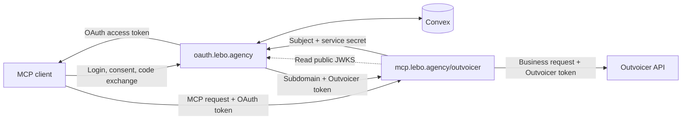
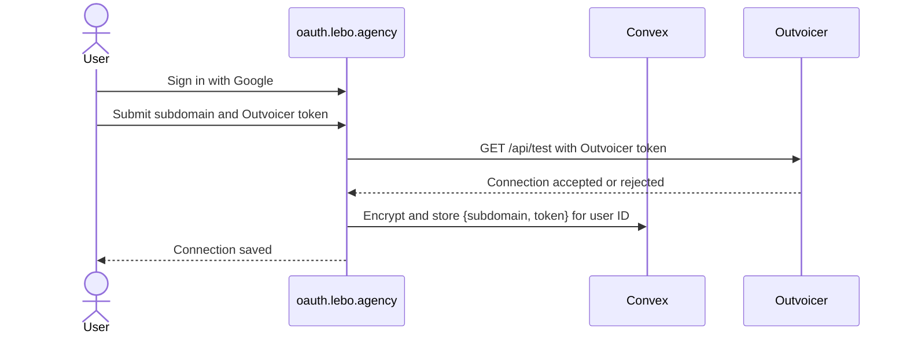
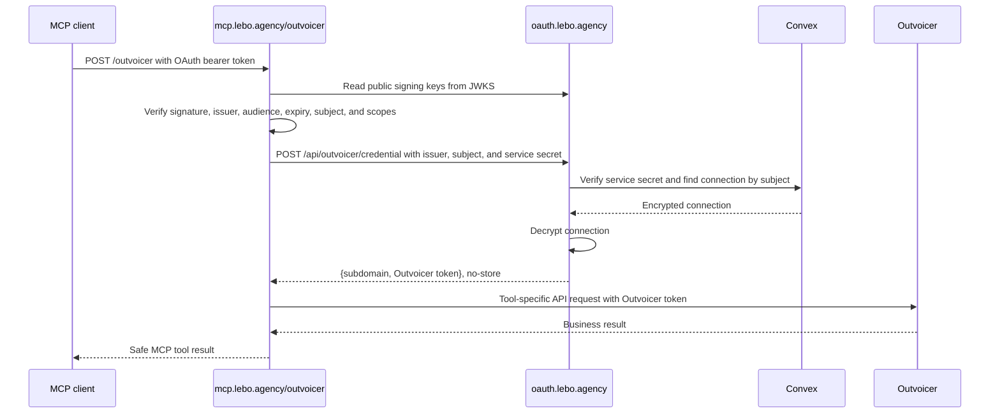

# How the Outvoicer MCP and OAuth Service Work Together

The public services are:

- MCP resource: `https://mcp.lebo.agency/outvoicer`
- OAuth issuer: `https://oauth.lebo.agency`

The OAuth service authenticates people and stores their Outvoicer connection. The MCP service validates OAuth access, privately resolves that connection, and uses it to call Outvoicer.

## Components

| Component                   | Responsibility                                                                                                                        |
| --------------------------- | ------------------------------------------------------------------------------------------------------------------------------------- |
| MCP client                  | ChatGPT, Claude, or another connector. Performs OAuth and sends MCP requests.                                                         |
| `oauth.lebo.agency`         | Handles Google login, consent, OAuth clients, authorization codes, access and refresh tokens, and Outvoicer connection storage.       |
| Convex                      | Stores OAuth data and encrypted Outvoicer connections for the OAuth service.                                                          |
| `mcp.lebo.agency/outvoicer` | Publishes MCP OAuth metadata, validates access tokens, enforces scopes, resolves the user's Outvoicer connection, and runs MCP tools. |
| Outvoicer                   | Stores business data and accepts requests authenticated with an Outvoicer API token.                                                  |



## Credential Separation

There are three different credentials. They are not interchangeable.

| Credential          | Where it moves                                         | Purpose                                                                                                            |
| ------------------- | ------------------------------------------------------ | ------------------------------------------------------------------------------------------------------------------ |
| OAuth access token  | OAuth service -> MCP client -> MCP service             | Identifies the user and authorizes a specific MCP resource and scopes.                                             |
| MCP service secret  | MCP service -> private OAuth credential endpoint       | Proves that the caller may resolve a stored Outvoicer connection. It is never sent to the MCP client or Outvoicer. |
| Outvoicer API token | Outvoicer -> OAuth storage -> MCP service -> Outvoicer | Authenticates business API requests. It is never included in an OAuth token or returned to the MCP client.         |

## Before OAuth: Saving the Outvoicer Connection

The user first signs in to `oauth.lebo.agency` with Google and enters an Outvoicer subdomain and API token.



The subdomain selects the Outvoicer tenant. A token alone is not enough because one token can access more than one subdomain. The connection is encrypted with `BETTER_AUTH_SECRET` before storage.

## Authorization Flow

### 1. The client discovers OAuth

The client initially calls the MCP endpoint without a token. The MCP service returns `401 Unauthorized` with this protected-resource metadata URL:

```text
https://mcp.lebo.agency/.well-known/oauth-protected-resource/outvoicer
```

That document tells the client:

```json
{
  "resource": "https://mcp.lebo.agency/outvoicer",
  "authorization_servers": ["https://oauth.lebo.agency"],
  "scopes_supported": ["invoice:read", "invoice:create"],
  "bearer_methods_supported": ["header"]
}
```

The client then reads OAuth server metadata from:

```text
https://oauth.lebo.agency/.well-known/oauth-authorization-server
```

This publishes the authorization, token, dynamic registration, introspection, revocation, and JWKS endpoints. It also declares authorization-code flow, refresh tokens, PKCE `S256`, and resource indicators.

### 2. The client registers and asks for consent

If needed, the MCP client dynamically registers its callback URL with the OAuth service. Public clients use PKCE instead of a client secret.

The client creates `state`, a PKCE verifier, and an `S256` challenge, then opens an authorization request containing:

- Its client ID and registered callback URL.
- The exact resource `https://mcp.lebo.agency/outvoicer`.
- One or more requested scopes.
- The random `state` value.
- The PKCE challenge.

The OAuth service rejects authorization for a different resource. It signs the user in with Google and displays the client, callback, resource, user, and requested scopes before the user approves or denies access.

### 3. OAuth returns a code and issues tokens

After approval, the OAuth service redirects to the registered client callback with:

- A one-use authorization code.
- The original `state`.
- The OAuth issuer identifier.

The client verifies `state`, then exchanges the code with its original callback URL and PKCE verifier. Authorization codes expire after five minutes.

The access token is a signed JWT that expires after 15 minutes. Its relevant claims are:

```json
{
  "iss": "https://oauth.lebo.agency",
  "sub": "<oauth-user-id>",
  "aud": "https://mcp.lebo.agency/outvoicer",
  "azp": "<oauth-client-id>",
  "scope": "invoice:read invoice:create",
  "iat": "<issued-at>",
  "exp": "<expiry>"
}
```

The JWT does not contain the user's email, Outvoicer subdomain, or Outvoicer API token. A refresh token is issued only when `offline_access` is requested and approved.

## Authenticated MCP Request



For every authenticated MCP request, the MCP service:

1. Reads the OAuth bearer token from the `Authorization` header.
2. Verifies its signature using the OAuth service's public JWKS.
3. Requires the exact issuer and MCP audience.
4. Requires a non-expired token with a user subject and at least one supported scope.
5. Sends only the verified issuer and subject to the private OAuth credential endpoint.
6. Authenticates that private request with the MCP service secret.
7. Receives the user's decrypted `{subdomain, token}` connection with `Cache-Control: no-store`.
8. Keeps the connection only in request-scoped memory while the MCP tool runs.

The MCP service is stateless: it does not persist OAuth tokens, Outvoicer credentials, or MCP sessions.

## Tool Data Flow

### `prepare-invoice`

Required scope: `invoice:read`

The MCP client sends invoice date, client and product identifiers or selected IDs, quantities, and optional line values. When IDs need resolution, the MCP service calls Outvoicer with the stored Outvoicer token:

- `GET /api/client`
- `GET /api/product`

The MCP result contains matching client or product choices, or a prepared invoice payload. Choices expose IDs and names rather than the Outvoicer token or complete upstream records.

### `create-invoice`

Required scope: `invoice:create`

The MCP client sends the prepared invoice payload:

```json
{
  "date": "2026-07-23",
  "client": "<outvoicer-client-id>",
  "lines": [
    {
      "product": "<outvoicer-product-id>",
      "amount": 1,
      "unitPrice": 100
    }
  ]
}
```

The MCP service sends it to `POST /api/sell` with the Outvoicer token and returns the created invoice ID. This creates an unsent invoice draft; it does not send the invoice.

## Data Storage

| Location               | Stored data                                                                                                                                                          |
| ---------------------- | -------------------------------------------------------------------------------------------------------------------------------------------------------------------- |
| OAuth service / Convex | Users, sessions, OAuth clients, short-lived authorization codes, consents, refresh-token state, signing keys, rate-limit state, and encrypted Outvoicer connections. |
| MCP service            | Nothing persistent. Verified identity and decrypted Outvoicer connection exist only for the current request.                                                         |
| MCP client             | OAuth access token and, if granted, refresh token. It never receives the MCP service secret or Outvoicer token.                                                      |
| Outvoicer              | Clients, products, invoices, and other business data. It receives the Outvoicer token, never the OAuth token.                                                        |

## Failure Boundaries

- Missing or invalid OAuth token: MCP returns `401` and the protected-resource metadata URL.
- Valid token without the tool's scope: MCP returns an insufficient-scope error.
- User has no saved Outvoicer connection: MCP returns a connection-required error.
- Private credential service is unavailable or returns invalid data: MCP returns a service-unavailable error.
- Outvoicer rejects a business request: the tool returns an error without exposing stored credentials.

## Security Guarantees

- PKCE binds an authorization code to the client that started the flow.
- `state` binds the OAuth callback to the initiating client session.
- Exact callback validation prevents codes from being redirected elsewhere.
- Exact JWT issuer and audience checks prevent token substitution.
- Tool-specific scopes separate reading invoice data from creating invoice drafts.
- The MCP service secret protects the private credential endpoint.
- Outvoicer connections are encrypted at rest and returned with `no-store`.
- OAuth tokens are never sent to Outvoicer.
- Outvoicer tokens are never sent to the MCP client or included in MCP output.
